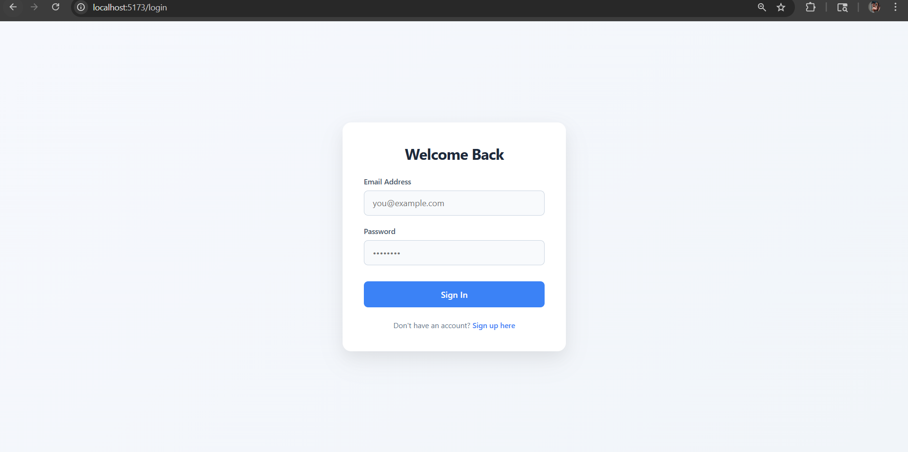
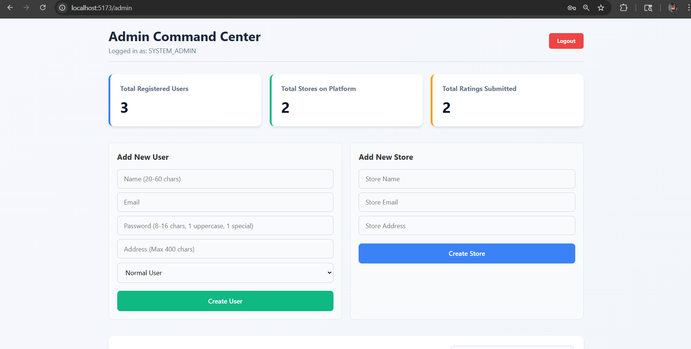
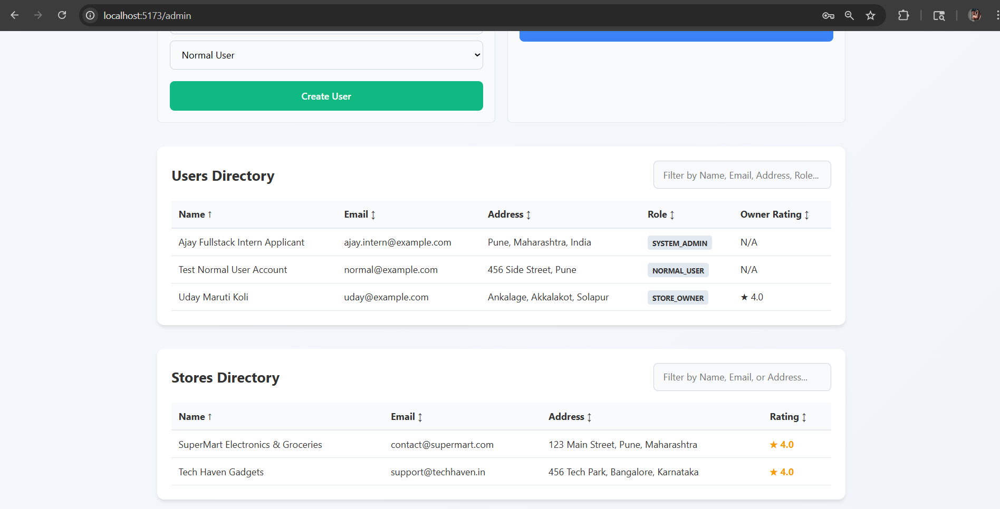
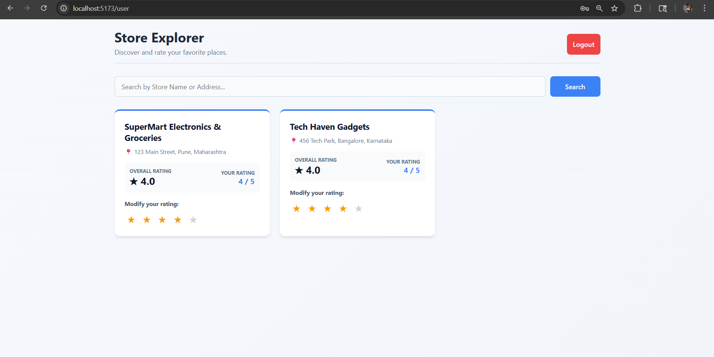
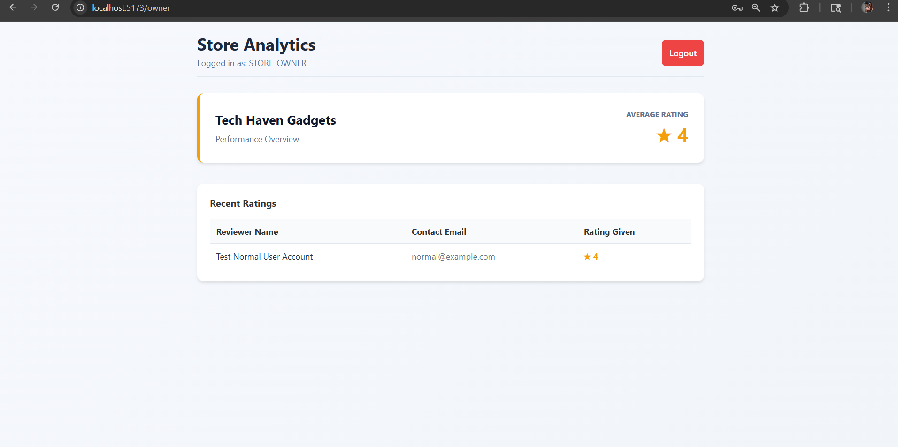

# Project Overview: Multi-Role Store Rating Platform

## 📌 Introduction

This project is a comprehensive Store Rating Platform designed to bridge the gap between customers and local businesses. It implements a secure, role-based ecosystem where different users have specific permissions and dashboards.

## 🏗️ System Architecture

### Backend (Node.js & Express)

- **RESTful API**: Designed with modular routes and controllers for clean separation of concerns.
- **Authentication**: Custom JWT-based middleware for role verification and secure session management.
- **Security**: Industry-standard password hashing using bcrypt and strict input validation on all POST/PUT routes.

### Frontend (React.js)

- **State Management**: React Context API for global authentication state and user persistence.
- **Routing**: React Router DOM with `ProtectedRoute` wrappers to prevent unauthorized access.
- **UI/UX**: Modern, responsive design focusing on clean data presentation and intuitive navigation.

### Database (PostgreSQL)

- **Relational Integrity**: Foreign key constraints ensure data consistency between users, stores, and ratings.
- **Performance**: Optimized queries utilizing `COALESCE` and `ROUND` for accurate, real-time rating calculations.

## 📸 Feature Walkthrough (Screenshots)

Note: Replace the placeholder images with real screenshots from the running app.

### 1. Secure Unified Login

The gateway to the platform. Based on the credentials, the system automatically redirects users to their respective dashboards (Admin, User, or Owner).

### 2. Admin Command Center

A bird's-eye view of the platform's health, showing real-time statistics (Total Users, Stores, Ratings) and management forms.

### 3. User Store Explorer

A clean, searchable grid where users can discover stores, view average ratings, and provide instant feedback via the interactive star-rating component.

### 4. Store Owner Analytics

Detailed performance metrics for business owners, providing a transparent view of every individual rating and reviewer.

## 🚀 Key Challenges & Solutions

- **Real-time Updates**: Implemented a callback system in React where child forms (Add User/Store) trigger a data refresh in the parent dashboard, ensuring the UI always matches the database.
- **Rating Logic**: Used the `INSERT ... ON CONFLICT` (UPSERT) logic in PostgreSQL to allow users to modify ratings without creating duplicate entries.
- **Strict Validation**: Built custom regex and length checks to meet the specific requirements for Name (20-60 chars) and Password complexity.

---

**Developed by**: Ajay  
**Date**: March 2026
